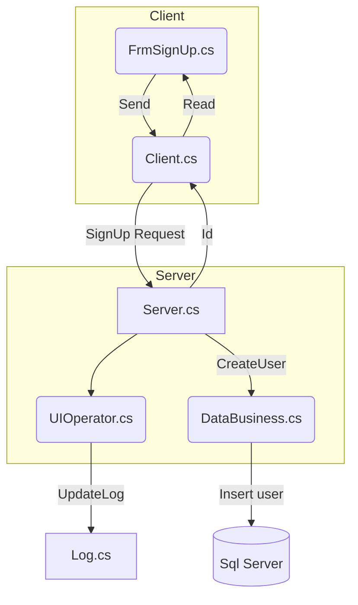
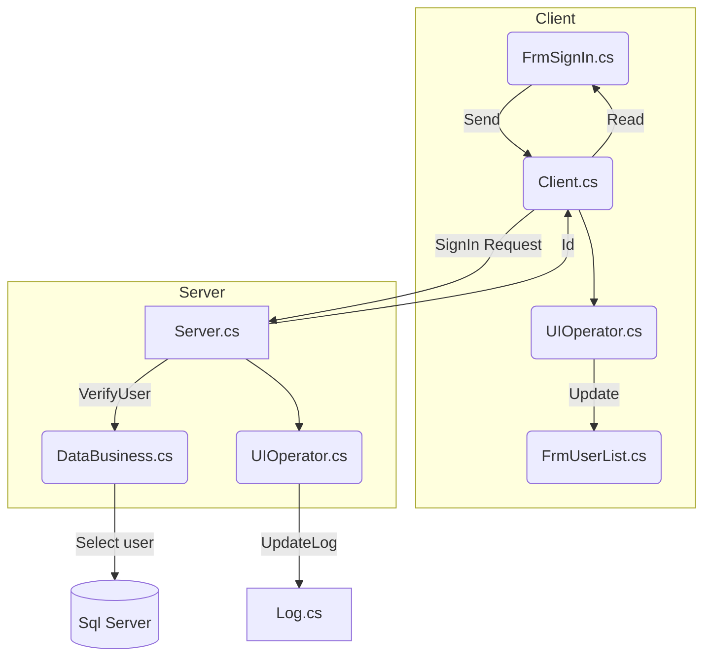
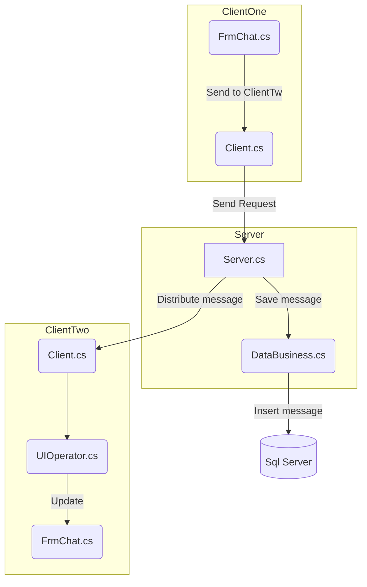

#Messeger
[](https://travis-ci.org/yongwang0705/Messager)
[](LICENSE)
[](https://github.com/yongwang0705/Messager/pulls)
[](https://github.com/yongwang0705/Messager)
[](https://github.com/yongwang0705/Messager)

## Introduction
A C/S windows desktop application which aims to offer the complete solution on internal communication of enterprise. It’s built on .Net FrameWork 4.7.2 and Asure.  It supports registration, user identity verification and messages distribution etc.
## Functions Flowchat
#### <center>SignUp

#### <center>SignIn

#### <center>Message Send


## Architechture
```mermaid
graph TB;
MoninorThread(FrmChat.cs)

````